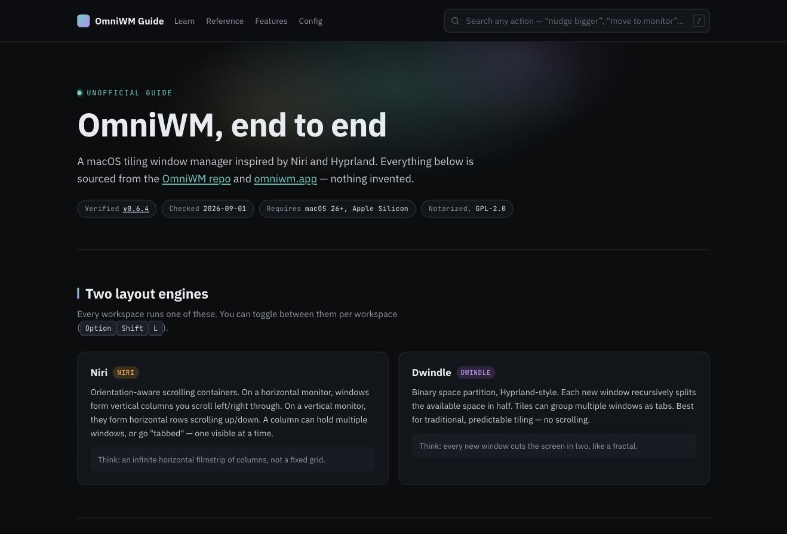

# OmniWM Guide

Single-page reference and onboarding guide for [OmniWM](https://github.com/BarutSRB/OmniWM), a macOS tiling window manager.

  

Live search over every shortcut and CLI command, layout-aware filtering (Niri/Dwindle/Shared), and a short onboarding path for anyone new to tiling window managers.

Verified against OmniWM [v0.6.4](https://github.com/BarutSRB/OmniWM/releases/tag/v0.6.4) · checked 2026-09-01.

## Source data

All facts (shortcuts, CLI commands, config) are verified verbatim against the OmniWM repo/docs and kept as an OKF-spec knowledge bundle in [`okf/`](./okf), with the frozen dataset in [`data.js`](./data.js).

## License

[MIT](./LICENSE)
